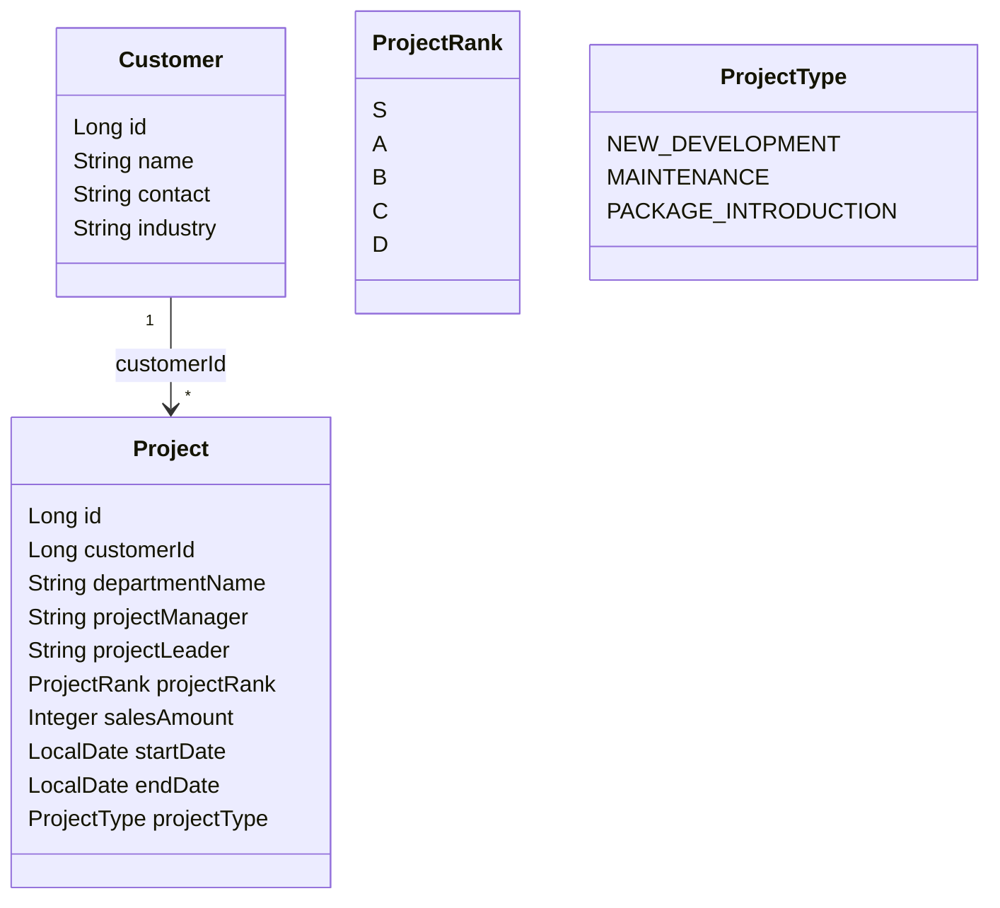

# クラス図（Mermaid形式）

このシステムの主要なドメインモデル（顧客・プロジェクト・ランク・種別）の関係をMermaid記法で図示。

- Customer（顧客）: 顧客マスタ情報
- Project（プロジェクト）: 顧客に紐づくプロジェクト情報
- ProjectRank: プロジェクトの売上金額に応じたランク（S/A/B/C/D）
- ProjectType: プロジェクト種別（新規開発・保守・パッケージ導入）

